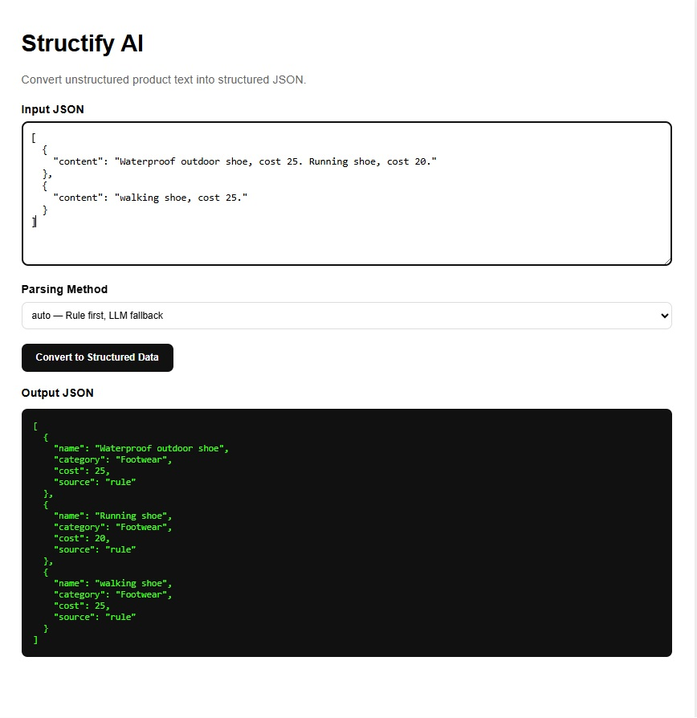

# Structify AI

> 將非結構化文字資料轉換為結構化 JSON 的 AI Backend 小專案，支援 Rule-based Parsing、LLM Structured Output，以及 Auto Fallback 模式。

---

## UI 預覽



---

## 功能特色

- **Rule-based Parsing** — 用 Regex 快速解析格式固定的文字，速度快、成本低
- **LLM Structured Output** — 透過 Azure OpenAI 解析自然語言描述，彈性高
- **Auto Fallback** — 先跑 Rule-based，失敗自動 fallback 到 LLM，兼顧效能與準確率
- **多產品偵測** — 單筆 content 含多個產品時自動拆分，各別解析
- **Pydantic 驗證** — 每筆結果都經過欄位驗證，確保資料品質

---

## 非結構化資料 → 結構化資料：設計說明

### 什麼是非結構化資料？

非結構化資料是指**沒有預定義格式或 schema 的文字內容**，無法直接被程式讀取為欄位。常見來源包括：

- 人工輸入的商品描述
- Email、客服對話紀錄
- PDF 報告、OCR 掃描結果
- 爬蟲抓取的網頁文字

例如以下都是描述同一雙鞋的「非結構化」文字，但格式各不相同：

```
"Waterproof outdoor shoe, cost 25."
"This waterproof hiking shoe is priced at around 25 dollars."
"防水登山鞋，售價 25 元。"
```

### 結構化的目標

本專案將任意格式的產品文字，統一轉換為固定 JSON Schema：

```
非結構化輸入                              結構化輸出
─────────────────────────────────────    ──────────────────────────────────────
"Waterproof outdoor shoe, cost 25."  →  { "name": "Waterproof outdoor shoe",
                                           "category": "Footwear",
                                           "cost": 25.0,
                                           "source": "rule" }
```

輸出的每筆資料都包含四個固定欄位：`name`（產品名稱）、`category`（分類）、`cost`（費用）、`source`（解析來源）。

---

### 方法一：Rule-based Parsing

**原理**：用正規表達式（Regex）從文字中抽取關鍵資訊。

**step 1 — 抽取 cost**

```python
re.search(r"cost\s*:?\s*(\d+(\.\d+)?)", content, re.IGNORECASE)
```

匹配 `cost 25`、`cost: 25`、`cost25` 等多種寫法，取出數字部分。

**step 2 — 抽取 name**

將 cost 描述從原文移除，再清除尾端多餘的標點與空白：

```
"Waterproof outdoor shoe, cost 25."
        ↓ 移除 "cost 25"
"Waterproof outdoor shoe, "
        ↓ 清除尾端 ",  "
"Waterproof outdoor shoe"
```

**step 3 — 推論 category**

依關鍵字比對推論分類：

| 關鍵字 | 分類 |
|--------|------|
| shoe、sneaker、boot、sandal | Footwear |
| shirt、jacket、pants、coat | Apparel |
| bag、backpack、luggage | Bag |
| 其他 | Unknown（觸發 fallback）|

**優點**：速度快、成本零、結果可預期  
**限制**：只能處理格式固定的輸入；自然語言描述、缺少關鍵字時會失敗

---

### 方法二：LLM Structured Output

**原理**：將原文交給語言模型，要求它依照固定 schema 輸出 JSON。

**System Prompt 設計**

```
You are a data extraction assistant.
Extract ALL products from the user's text.

Return ONLY valid JSON:
{
  "products": [
    { "name": "...", "category": "...", "cost": <number> }
  ]
}
```

透過 `response_format: {"type": "json_object"}` 強制模型輸出合法 JSON，避免 markdown 包裝或自由文字混入。

**處理複雜輸入的能力**

Rule-based 無法處理的輸入，LLM 能正確解析：

```
輸入：
"This waterproof hiking shoe is designed for outdoor use.
 The production cost is around 25 dollars."

Rule-based：cost 無法匹配（"around 25 dollars" 無 cost 關鍵字）→ 失敗
LLM：理解語意，正確抽出 cost = 25
```

**優點**：可處理任意自然語言、多語言、格式不固定的輸入  
**限制**：需要 API Key、延遲較高、有 token 成本、需要做二次驗證

---

### 方法三：Auto Mode（推薦）

**原理**：每筆資料先用 Rule-based 解析，只有在 **Pydantic 驗證失敗**時才 fallback 到 LLM。

```
每一個 product segment
        ↓
  Rule-based Parser
        ↓
  Pydantic 驗證
  ┌─────┴──────┐
通過           失敗（name 空 / category Unknown / cost ≤ 0）
  ↓               ↓
直接回傳        LLM Parser
source: "rule"  source: "llm"
```

**實際效果**

| 輸入 | Rule | LLM fallback | source |
|------|------|--------------|--------|
| `"Running shoe, cost 20."` | 成功 | 不觸發 | `"rule"` |
| `"This hiking boot retails for about 30."` | cost = 0 → 驗證失敗 | 觸發 | `"llm"` |
| `"Generic item with no category info, cost 10."` | category = Unknown → 驗證失敗 | 觸發 | `"llm"` |

**設計意義**：簡單資料不浪費 LLM token；複雜資料仍能正確處理，在效能、成本與準確率之間取得最佳平衡。

---

### 多產品偵測

當一筆 `content` 包含多個產品時，系統先拆分再分別解析：

```
"Waterproof outdoor shoe, cost 25. Running shoe, cost 20."
        ↓ 偵測到兩個 cost → split_into_segments()
┌──────────────────────────────┐  ┌────────────────────────────┐
│ "Waterproof outdoor shoe,    │  │ "Running shoe, cost 20."   │
│  cost 25"                    │  │                            │
└──────────┬───────────────────┘  └───────────────┬────────────┘
           ↓                                      ↓
    Rule Parser                           Rule Parser
           ↓                                      ↓
  { name: "Waterproof...",          { name: "Running shoe",
    cost: 25, source: "rule" }        cost: 20, source: "rule" }
```

---

### Validation 層

無論哪個 parser 的輸出，都必須通過 Pydantic `ProductResult` model 驗證，才能進入最終回應：

```python
class ProductResult(BaseModel):
    name: str       # 不得為空字串
    category: str   # 不得為 "Unknown"
    cost: float     # 必須 > 0
    source: Literal["rule", "llm"]
```

驗證失敗在 auto mode 會觸發 LLM fallback；在 rule / llm mode 則直接回傳 422 錯誤，讓呼叫端感知資料品質問題。

---

### 延伸應用

結構化後的資料可作為後續資料管線的輸入：

- **MongoDB** — 寫入產品主檔，支援條件查詢與統計
- **Vector Database** — 將 `name + category + content` 組成 embedding，支援相似產品搜尋與 RAG

---

## 架構設計

### 整體流程

```
Frontend UI (React + Vite)
        ↓
POST /api/structure-data
        ↓
FastAPI Router → Service
        ↓
    Parser Router
    ├── Rule-based Parser   → Regex 抽取 name / cost，關鍵字推論 category
    ├── LLM Parser          → Azure OpenAI gpt-4o-mini，JSON structured output
    └── Auto Parser         → Rule 優先，ValidationError → fallback LLM
        ↓
Pydantic Validation
        ↓
Structured JSON Response
```

### 三種解析模式

| Mode | 策略 | 適合場景 |
|------|------|----------|
| `rule` | Regex 抽取 `cost`，移除後取得 `name`，關鍵字比對 `category` | 格式固定的批次資料 |
| `llm` | Azure OpenAI 依照固定 schema 回傳 JSON | 自然語言、PDF、Email、OCR |
| `auto` | Rule 優先；Pydantic 驗證失敗 → fallback LLM | **推薦的實務設計** |

### Validation 規則

每筆解析結果都需通過 Pydantic `ProductResult` model 驗證：

- `name` — 不得為空
- `category` — 不得為 `Unknown`（無法推論時在 auto mode 觸發 LLM fallback）
- `cost` — 必須為正數

### 多產品偵測

當單筆 `content` 含有多個 `cost` 關鍵字時，`split_into_segments()` 會依句點邊界自動拆分，各 segment 獨立解析：

```
"Waterproof outdoor shoe, cost 25. Running shoe, cost 20."
        ↓ split_into_segments()
["Waterproof outdoor shoe, cost 25", "Running shoe, cost 20."]
        ↓ 各別解析
[{ name: "Waterproof outdoor shoe", ... }, { name: "Running shoe", ... }]
```

---

## 快速開始

### 前置需求

- Docker + Docker Compose

### 1. 設定環境變數

```bash
cp backend/.env.example backend/.env
```

編輯 `backend/.env`，填入 Azure OpenAI 憑證：

```env
AZURE_OPENAI_ENDPOINT=https://<your-resource>.openai.azure.com/
AZURE_OPENAI_API_KEY=<your-api-key>
AZURE_OPENAI_API_VERSION=2024-02-01
AZURE_OPENAI_DEPLOYMENT=gpt-4o-mini
```

### 2. 啟動服務

```bash
docker compose up --build
```

| 服務 | URL |
|------|-----|
| 前端 UI | http://localhost:5173 |
| 後端 API | http://localhost:8100 |
| Swagger Docs | http://localhost:8100/docs |

---

## API

### `POST /api/structure-data`

**Request**

```json
{
  "method": "auto",
  "rawData": [
    { "content": "Waterproof outdoor shoe, cost 25. Running shoe, cost 20." },
    { "content": "walking shoe, cost 25." }
  ]
}
```

**Response**

```json
{
  "success": true,
  "method": "auto",
  "data": [
    { "name": "Waterproof outdoor shoe", "category": "Footwear", "cost": 25.0, "source": "rule" },
    { "name": "Running shoe",            "category": "Footwear", "cost": 20.0, "source": "rule" },
    { "name": "walking shoe",            "category": "Footwear", "cost": 25.0, "source": "rule" }
  ]
}
```

`source` 欄位說明每筆資料由哪個 parser 產生（`"rule"` 或 `"llm"`）。

---

## 專案結構

```
structify-ai/
├── docker-compose.yml
├── backend/
│   ├── main.py                              # FastAPI app entry point
│   ├── requirements.txt
│   ├── .env.example
│   └── app/
│       ├── models/product.py                # Pydantic request / response models
│       ├── routers/structure_data.py        # POST /api/structure-data
│       ├── services/structure_data_service.py
│       ├── parsers/
│       │   ├── rule_parser.py               # Regex-based extraction
│       │   ├── llm_parser.py                # Azure OpenAI integration
│       │   └── auto_parser.py               # Rule-first with LLM fallback
│       └── utils/category_util.py           # Keyword-based category inference
└── frontend/
    ├── src/App.jsx                          # Single-page UI
    └── vite.config.js
```

---

## 本地開發（不用 Docker）

```bash
# Backend
cd backend
pip install -r requirements.txt
uvicorn main:app --reload

# Frontend
cd frontend
npm install
npm run dev
```
