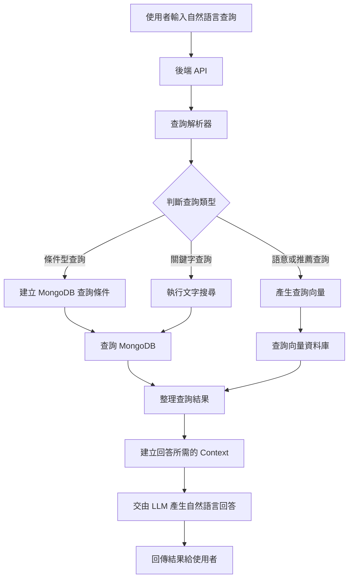
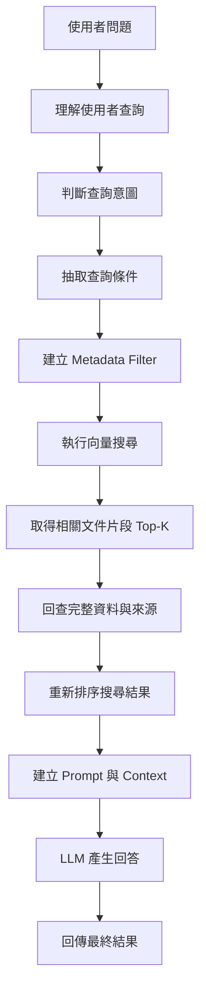
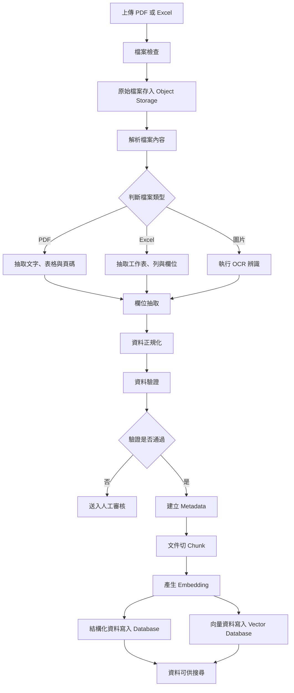
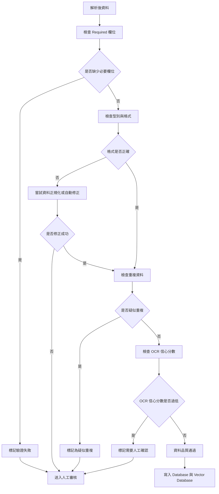

# AI Backend Engineer 技術測驗

# 第一部分：資料建模與結構化設計

## 題目一：資料分類

企業未來希望建立 AI 助理，讓使用者能透過自然語言查詢公司內部資料。

目前資料來源包含：

* Excel
* PDF
* Word 文件
* 圖片
* 資料庫
* BOM 表
* Email

請說明：

A. 哪些資料適合存放於 Structured Data？
B. 哪些資料適合存放於 Unstructured Data？
並說明原因。

---

## 題目一答案

資料可依照使用方式分為 **Structured Data** 與 **Unstructured Data**。

Structured Data 指的是具備固定欄位、型別明確、可建立索引與條件查詢的資料。這類資料適合存放在 MongoDB、PostgreSQL、MySQL 等資料庫中。

Unstructured Data 則是指文件內容、自然語言文字、Email 內文、OCR 文字等格式較不固定的資料。這類資料比較適合用於全文搜尋、Chunking、Embedding 與 Vector Search。

---

### A. 適合存放於 Structured Data 的資料

| 資料來源                | 說明                          |
| ------------------- | --------------------------- |
| 資料庫                 | 原本就有明確欄位、型別與關聯，適合直接作為結構化資料  |
| BOM 表               | 通常包含料號、品名、數量、版本、成本、供應商等固定欄位 |
| Excel               | 若內容為產品清單、成本表、庫存表，可轉為結構化資料   |
| Email metadata      | 寄件者、收件者、時間、主旨、附件名稱可欄位化      |
| PDF / Word metadata | 文件名稱、作者、建立時間、版本、部門可結構化      |
| 圖片 metadata         | 檔名、格式、大小、上傳時間、OCR 信心分數可結構化  |

範例：

```json
{
  "product_id": "PROD-000001",
  "name": "Outdoor Shoe",
  "category": "Footwear",
  "cost": 25,
  "owner": "David"
}
```

這類資料適合支援以下查詢：

```text
成本低於 30 的產品
某個負責人底下的產品
某個 category 的產品
近一年建立的產品
```

---

### B. 適合存放於 Unstructured Data 的資料

| 資料來源       | 說明                                 |
| ---------- | ---------------------------------- |
| PDF 內文     | 多為文件段落、規格說明或產品描述                   |
| Word 文件內容  | 內容通常為自然語言文字，適合切 chunk 後做 embedding |
| 圖片 OCR 結果  | OCR 文字格式不固定，適合做語意搜尋                |
| Email body | 信件內容通常是自由文字                        |
| Excel 備註欄  | 若欄位內容為說明或備註，可視為非結構化文字              |
| BOM 備註     | 替代料原因、設計說明等內容可做語意搜尋                |

---

### 綜合設計

實務上可採用混合式設計，不必將資料硬性歸類到單一儲存方式。

例如一份 PDF 可拆成：

```text
PDF 原始檔案 → Object Storage
PDF metadata → MongoDB
PDF 內文 chunks → Vector Database
```

這樣可以同時支援：

```text
資料庫條件查詢
文件全文搜尋
向量語意搜尋
RAG 問答
資料來源追蹤
```

---

## 題目二：資料欄位化設計

系統收到以下非結構化資料：

```text
Product:
Outdoor Shoe

Category:
Footwear

Material:
Waterproof Fabric

Cost:
25

Launch Date:
2026-08-01

Owner:
David
```

請設計：

1. MongoDB Document Schema
2. 說明：

   * 哪些欄位應設為 Required
   * 哪些欄位適合建立 Index
   * 哪些欄位適合作為搜尋條件

---

## 題目二答案

此資料已具備明確欄位，可整理為產品主檔並存入 MongoDB。

---

### 1. MongoDB Document Schema

```json
{
  "_id": "ObjectId",
  "product_id": "PROD-000001",
  "name": "Outdoor Shoe",
  "category": "Footwear",
  "material": "Waterproof Fabric",
  "cost": 25,
  "currency": "USD",
  "launch_date": "2026-08-01T00:00:00Z",
  "owner": "David",
  "status": "active",
  "tags": ["outdoor", "shoe", "waterproof"],
  "description": "Outdoor Shoe made with Waterproof Fabric.",
  "created_at": "2026-08-01T00:00:00Z",
  "updated_at": "2026-08-01T00:00:00Z"
}
```

---

### 2. Required 欄位

以下欄位建議設為 Required：

| 欄位          | 原因                    |
| ----------- | --------------------- |
| product_id  | 產品唯一識別碼，避免重複          |
| name        | 產品名稱是顯示與搜尋的主要欄位       |
| category    | 後續分類查詢與推薦會使用          |
| material    | 可支援材質搜尋，例如 waterproof |
| cost        | 支援成本條件查詢，例如成本低於 30    |
| launch_date | 支援近一年建立產品的查詢          |
| owner       | 用於資料負責人與權限管理          |
| status      | 判斷產品資料是否有效            |

---

### 3. Index 設計

常用查詢欄位應建立 index。

```javascript
db.products.createIndex({ product_id: 1 }, { unique: true })
db.products.createIndex({ category: 1 })
db.products.createIndex({ cost: 1 })
db.products.createIndex({ launch_date: -1 })
db.products.createIndex({ owner: 1 })
db.products.createIndex({ tags: 1 })
db.products.createIndex({ status: 1 })
db.products.createIndex({ category: 1, cost: 1 })
```

若需要支援文字搜尋，可建立 text index：

```javascript
db.products.createIndex({
  name: "text",
  material: "text",
  description: "text"
})
```

---

### 4. 適合作為搜尋條件的欄位

| 欄位          | 用途                 |
| ----------- | ------------------ |
| product_id  | 精準查詢單一產品           |
| name        | 產品名稱搜尋             |
| category    | 產品分類搜尋             |
| material    | 材質搜尋，例如 waterproof |
| cost        | 成本區間查詢             |
| launch_date | 時間區間查詢             |
| owner       | 負責人查詢              |
| tags        | 標籤搜尋               |
| status      | 過濾有效或停用資料          |

---

# 第二部分：AI 搜尋架構設計

---

## 題目三：自然語言查詢

使用者可能輸入：

* 找出所有防水產品
* 找出成本低於 30 元的產品
* 找出近一年建立的產品
* 推薦相似產品

請設計：

* Database Schema
* API Flow
* Query Parsing Flow

並描述完整處理流程：

```text
User
 ↓
Backend API
 ↓
?
 ↓
Database
 ↓
LLM
 ↓
Response
```

---

## 題目三答案

自然語言查詢可分為兩類處理：

```text
條件型查詢：例如成本低於 30、近一年建立
語意型查詢：例如推薦相似產品、防水產品
```

條件明確的查詢應由後端轉成資料庫查詢；LLM 主要負責理解語意、整理結果與產生自然語言回答，不應直接操作資料庫。

---

### 1. Database Schema

#### products collection

```json
{
  "product_id": "PROD-000001",
  "name": "Outdoor Shoe",
  "category": "Footwear",
  "material": "Waterproof Fabric",
  "cost": 25,
  "launch_date": "2026-08-01T00:00:00Z",
  "owner": "David",
  "status": "active",
  "tags": ["outdoor", "waterproof", "shoe"],
  "description": "Outdoor Shoe made with Waterproof Fabric.",
  "embedding_id": "vec-prod-000001"
}
```

#### document_chunks collection

```json
{
  "chunk_id": "CHUNK-000001",
  "product_id": "PROD-000001",
  "source_type": "PDF",
  "content": "The Outdoor Shoe is made with waterproof fabric.",
  "embedding_id": "vec-chunk-000001",
  "metadata": {
    "category": "Footwear",
    "tags": ["waterproof", "outdoor"],
    "page": 3
  }
}
```

---

### 2. API Flow



---

### 3. Query Parsing Flow

使用者輸入：

```text
找出成本低於 30 元的產品
```

後端可解析為：

```json
{
  "intent": "filter_search",
  "filters": {
    "cost": {
      "$lt": 30
    }
  },
  "sort": {
    "cost": 1
  }
}
```

MongoDB 查詢：

```javascript
db.products.find({
  cost: { $lt: 30 },
  status: "active"
}).sort({ cost: 1 })
```

---

### 4. 不同查詢對應策略

| 使用者問題          | 處理方式                                         |
| -------------- | -------------------------------------------- |
| 找出所有防水產品       | 查詢 material、tags、description 是否包含 waterproof |
| 找出成本低於 30 元的產品 | 使用 MongoDB cost filter                       |
| 找出近一年建立的產品     | 使用 launch_date filter                        |
| 推薦相似產品         | 使用 Vector Search 找相似資料，再交由 LLM 整理推薦理由        |

---

## 題目四：Metadata 設計

若未來需要支援：

* 條件搜尋
* AI 推薦
* 相似文件搜尋

請設計 Metadata Schema。

並說明：

* 哪些欄位適合 Filter
* 哪些欄位適合 Embedding
* 哪些欄位適合排序

---

## 題目四答案

Metadata 的目的主要是讓資料可以被過濾、排序、權限控管，也能在向量搜尋前縮小搜尋範圍。

---

### 1. Metadata Schema

```json
{
  "entity_type": "product",
  "entity_id": "PROD-000001",
  "source": {
    "source_type": "PDF",
    "file_name": "outdoor_shoe_spec.pdf",
    "page": 1
  },
  "business": {
    "product_name": "Outdoor Shoe",
    "category": "Footwear",
    "material": "Waterproof Fabric",
    "cost": 25,
    "launch_date": "2026-08-01",
    "owner": "David",
    "status": "active"
  },
  "search": {
    "tags": ["outdoor", "waterproof", "shoe"],
    "keywords": ["waterproof", "fabric", "outdoor shoe"],
    "language": "en"
  },
  "quality": {
    "parse_confidence": 0.98,
    "ocr_confidence": null,
    "validation_status": "passed"
  },
  "audit": {
    "created_at": "2026-08-01T00:00:00Z",
    "updated_at": "2026-08-01T00:00:00Z"
  }
}
```

---

### 2. 適合 Filter 的欄位

以下欄位適合用於條件篩選：

```text
entity_type
source_type
category
material
cost
launch_date
owner
status
tags
validation_status
created_at
updated_at
```

範例：

```json
{
  "category": "Footwear",
  "cost": {
    "$lt": 30
  },
  "tags": {
    "$in": ["waterproof"]
  },
  "status": "active"
}
```

---

### 3. 適合 Embedding 的欄位

適合 Embedding 的欄位通常是具有語意的文字內容，例如：

```text
product_name
description
material
tags
keywords
document content
OCR text
Email body
BOM note
```

Embedding 文字可整理為：

```text
Product Name: Outdoor Shoe.
Category: Footwear.
Material: Waterproof Fabric.
Tags: outdoor, waterproof, shoe.
```

---

### 4. 適合排序的欄位

```text
cost
launch_date
created_at
updated_at
similarity_score
parse_confidence
ocr_confidence
```

常見排序情境包括：

```text
成本由低到高
建立日期由新到舊
相似度由高到低
資料品質分數由高到低
```

---

# 第三部分：RAG 與向量搜尋

---

## 題目五：文件搜尋

系統中有：

* PDF
* Word
* Excel
* 圖片 OCR 結果

使用者提問：

```text
請推薦符合特定條件的產品並提供建議
```

請說明系統流程，包含：

* Query Understanding
* Metadata Filter
* Vector Search
* Context Retrieval
* LLM Response Generation

---

## 題目五答案

文件搜尋可採用 RAG 流程處理。重點是先理解使用者條件，再用 metadata 過濾資料範圍，接著做向量搜尋，最後將查詢到的內容提供給 LLM 產生回答。

---

### 1. 系統流程



---

### 2. Query Understanding

例如使用者輸入：

```text
請推薦成本低於 30 元、防水、適合戶外使用的鞋類產品
```

可解析成：

```json
{
  "intent": "product_recommendation",
  "filters": {
    "category": "Footwear",
    "cost": {
      "$lt": 30
    },
    "tags": ["waterproof", "outdoor"]
  },
  "semantic_query": "waterproof outdoor footwear product recommendation"
}
```

---

### 3. Metadata Filter

在做向量搜尋前，先用 metadata 篩選符合條件的資料：

```json
{
  "category": "Footwear",
  "cost": {
    "$lt": 30
  },
  "status": "active",
  "tags": {
    "$in": ["waterproof", "outdoor"]
  }
}
```

這樣可以避免在所有文件中做向量搜尋，提升查詢效率。

---

### 4. Vector Search

將使用者查詢轉成 embedding，例如：

```text
waterproof outdoor footwear product recommendation
```

再到 Vector Database 找相似的產品描述、文件段落、OCR 結果或 Excel 備註。

---

### 5. Context Retrieval

取得向量搜尋結果後，需要回資料庫取得完整資料，例如：

```text
產品主檔
產品規格
成本資訊
BOM 資料
相關文件 chunk
圖片 OCR 內容
```

---

### 6. LLM Response Generation

最後將整理後的 context 提供給 LLM，產生推薦結果。

回答內容可包含：

```text
推薦產品
推薦原因
成本
相關規格
注意事項
資料來源
```

範例回答：

```text
推薦 Outdoor Shoe。

原因如下：
1. 成本為 25，符合低於 30 的條件。
2. 材質為 Waterproof Fabric，符合防水需求。
3. 類別為 Footwear，符合鞋類產品需求。
4. 文件內容顯示此產品適合戶外使用。

注意事項：
若使用於長時間浸水或高濕度環境，建議進一步確認防水等級。
```

---

## 題目六：向量資料庫設計

請說明：

* 哪些資料應存放於 MongoDB？
* 哪些資料應存放於 Vector Database？

並說明原因。

---

## 題目六答案

MongoDB 與 Vector Database 的用途不同。MongoDB 適合存放可查詢、可過濾、可更新的結構化資料；Vector Database 則適合存放 embedding，用於相似度搜尋與語意搜尋。

---

### 1. MongoDB 應存放的資料

MongoDB 建議存放：

```text
產品主檔
BOM 主檔
文件 metadata
Email metadata
圖片 metadata
使用者權限
資料驗證狀態
chunk metadata
embedding_id 對應
```

範例：

```json
{
  "product_id": "PROD-000001",
  "name": "Outdoor Shoe",
  "category": "Footwear",
  "material": "Waterproof Fabric",
  "cost": 25,
  "owner": "David",
  "status": "active",
  "embedding_id": "vec-prod-000001"
}
```

MongoDB 主要負責：

```text
精準查詢
成本篩選
日期篩選
分類查詢
資料狀態管理
權限控管
```

---

### 2. Vector Database 應存放的資料

Vector Database 建議存放：

```text
產品描述 embedding
文件 chunk embedding
OCR text embedding
Email body embedding
BOM note embedding
```

範例：

```json
{
  "id": "vec-chunk-000001",
  "vector": [0.012, -0.233, 0.894],
  "content": "Outdoor Shoe is made with waterproof fabric.",
  "metadata": {
    "product_id": "PROD-000001",
    "category": "Footwear",
    "source_type": "PDF"
  }
}
```

Vector Database 主要負責：

```text
相似度搜尋
自然語言查詢
相似產品推薦
RAG context retrieval
相似文件搜尋
```

---

### 3. 分工原則

| 項目   | MongoDB           | Vector Database        |
| ---- | ----------------- | ---------------------- |
| 資料型態 | 結構化 / 半結構化        | 向量與語意內容                |
| 查詢方式 | 條件查詢、精準查詢         | 相似度查詢                  |
| 適合資料 | 產品欄位、BOM、metadata | 文件內容、描述、OCR、Email body |
| 使用情境 | 成本低於 30、近一年產品     | 找相似產品、語意問答             |

---

## 題目七：大型資料量情境

假設系統擁有：

* 100 萬筆產品資料
* 50 萬份文件
* 20 萬張圖片
* 10 萬筆 BOM 資料

請設計：

1. Chunk Strategy
2. Embedding Strategy
3. Vector Index Strategy
4. Cache Strategy

並說明如何維持高效查詢。

---

## 題目七答案

在大型資料量下，重點不是把所有資料都直接丟進 LLM，而是要先做好 chunk、metadata、index 與 cache。

---

### 1. Chunk Strategy

不同資料來源需要不同切分方式。

#### PDF / Word

```text
依標題、章節、段落切分
每個 chunk 約 500～800 tokens
保留 page、section、document_id
必要時保留 50～100 tokens overlap
```

#### Excel

```text
表格型資料以 row 為單位結構化
描述或備註欄位可轉成 text chunk
保留 sheet_name、row_number、column_name
```

#### 圖片 OCR

```text
每張圖片先產生 OCR text
OCR 文字較長時依段落切 chunk
保留 image_id、ocr_confidence、bounding box
```

#### BOM

```text
BOM 主資料存 MongoDB
BOM 備註、替代料說明、設計原因可做 embedding
依 product_id、part_number、version 分組
```

---

### 2. Embedding Strategy

Embedding 可依資料類型分開處理：

```text
product_embedding：產品名稱 + 類別 + 材質 + 描述 + tags
document_chunk_embedding：文件段落
ocr_embedding：圖片 OCR 文字
bom_note_embedding：BOM 備註
email_embedding：Email body
```

Embedding text 範例：

```text
Product Name: Outdoor Shoe.
Category: Footwear.
Material: Waterproof Fabric.
Cost: 25.
Tags: outdoor, waterproof, shoe.
```

更新策略：

```text
新增資料：即時 embedding
大量匯入：batch embedding
修改資料：只更新異動 chunk
刪除資料：soft delete 或標記 inactive
模型升級：背景重新 embedding
```

---

### 3. Vector Index Strategy

大量資料情境下應使用 ANN index，例如：

```text
HNSW：適合低延遲查詢
IVF：適合大規模資料切分
PQ：適合向量壓縮
Hybrid Search：metadata filter + vector search
```

資料可依類型拆分 collection 或 namespace：

```text
vector_products
vector_documents
vector_images_ocr
vector_bom_notes
vector_emails
```

這樣查詢時可以先判斷資料類型，不必每次都查所有向量資料。

---

### 4. Cache Strategy

#### Query Cache

```text
key = user_role + query_hash + filter_hash
value = search_result
TTL = 5～30 分鐘
```

適合熱門查詢，例如：

```text
找出所有防水產品
推薦低成本鞋類產品
```

#### Embedding Cache

```text
key = text_hash + embedding_model_version
value = embedding vector
```

避免相同文字重複產生 embedding。

#### Metadata Cache

可快取：

```text
熱門產品 metadata
分類列表
標籤列表
使用者權限資料
熱門文件 metadata
```

---

### 5. 維持高效查詢的方式

```text
1. 先做 Query Classification，不讓所有查詢都走 Vector DB
2. 條件型查詢優先使用 MongoDB index
3. 語意型查詢才使用 Vector Search
4. Vector Search 前先套 Metadata Filter
5. topK 不宜過大，可先取 50，再 re-rank 前 10
6. 熱門查詢使用 Query Cache
7. Embedding 使用 hash cache 避免重複計算
8. 大量資料依類型拆 collection / namespace
9. 權限過濾應在查詢前處理
10. Embedding 與 indexing 使用背景任務處理
```

---

# 第四部分：資料匯入與 AI 訓練流程

---

## 題目八：文件上傳流程

當新的 PDF 或 Excel 被上傳時，請設計自動化流程：

```text
Upload
 ↓
Parse
 ↓
?
 ↓
?
 ↓
Database
 ↓
Vector Database
```

需包含：

* 資料解析
* 欄位整理
* 資料驗證
* Metadata 建立
* Chunking
* Embedding
* Indexing

---

## 題目八答案

新的 PDF 或 Excel 上傳後，流程不應只做檔案保存，還需要解析內容、整理欄位、建立 metadata，並產生 embedding 供後續搜尋使用。

---

### 1. 完整流程



---

### 2. Upload / File Validation

上傳時先處理：

```text
產生 file_id
檢查副檔名
檢查 MIME type
檢查檔案大小
建立 upload log
```

---

### 3. Object Storage

原始檔案建議放在 Object Storage，例如 S3、MinIO 或 Azure Blob。資料庫只保存檔案路徑與 metadata。

```json
{
  "file_id": "FILE-000001",
  "file_name": "product_spec.pdf",
  "source_type": "PDF",
  "storage_path": "s3://bucket/product_spec.pdf",
  "upload_status": "uploaded",
  "created_at": "2026-08-01T00:00:00Z"
}
```

---

### 4. Parse / OCR

不同檔案類型使用不同 parser：

| 檔案類型  | 處理方式                        |
| ----- | --------------------------- |
| PDF   | 抽取文字、頁碼、表格                  |
| Excel | 抽取 sheet、row、column         |
| Word  | 抽取標題、段落、表格                  |
| Image | OCR 辨識文字                    |
| Email | 抽取 subject、body、attachments |

---

### 5. Field Extraction

解析後的文字可進一步轉成結構化欄位。

例如：

```text
Product:
Outdoor Shoe
Category:
Footwear
Cost:
25
```

轉成：

```json
{
  "name": "Outdoor Shoe",
  "category": "Footwear",
  "cost": 25
}
```

欄位抽取方式可包含：

```text
Rule-based Parser
Regex
欄位對應表
LLM Structured Output
```

---

### 6. Data Normalization

欄位格式需要標準化：

```text
日期轉 ISO 8601
成本轉 number
類別轉標準 taxonomy
owner 對應內部 user_id
文字去除多餘空白
```

---

### 7. Data Validation

資料寫入前需檢查：

```text
Required fields 不可缺少
cost 必須為 number
launch_date 必須為合法日期
product_id 不可重複
category 必須存在於允許清單
```

---

### 8. Metadata Creation

建立 metadata 供查詢與權限控管使用。

```json
{
  "source_type": "PDF",
  "file_id": "FILE-000001",
  "category": "Footwear",
  "tags": ["waterproof", "outdoor", "shoe"],
  "owner": "David",
  "access_level": "internal",
  "parse_confidence": 0.96,
  "validation_status": "passed"
}
```

---

### 9. Chunking / Embedding / Indexing

文件內容切成 chunks 後產生 embedding。

```text
文件段落 → chunk
chunk → embedding
structured data → Database
embedding + metadata → Vector Database
```

最後處理完成後，資料即可支援自然語言查詢、文件搜尋與 RAG 回答。

---

## 題目九：資料品質管理

若上傳資料出現：

* 缺少欄位
* 格式錯誤
* 重複資料
* OCR 辨識錯誤

請設計處理機制。

---

## 題目九答案

資料品質管理的目標是避免錯誤資料直接進入資料庫或向量資料庫。資料匯入後應先經過 validation、normalization、duplicate check 與 OCR confidence check。

---

### 1. 整體品質流程



---

### 2. 缺少欄位

例如資料缺少 cost：

```json
{
  "name": "Outdoor Shoe",
  "category": "Footwear"
}
```

處理方式：

```text
1. 檢查 required fields
2. required 欄位缺少時，標記 validation_status = failed
3. optional 欄位缺少時，可給 null 或 default value
4. 可嘗試用 rule-based 或 LLM 補欄位
5. 補不齊則進入 manual review
```

錯誤紀錄：

```json
{
  "validation_status": "failed",
  "errors": [
    {
      "field": "cost",
      "type": "missing_required_field",
      "message": "Cost is required but missing."
    }
  ]
}
```

---

### 3. 格式錯誤

例如：

```text
Cost = "twenty five"
Launch Date = "2026/8/1"
```

處理方式：

```text
1. 先嘗試自動轉型
2. 成功轉型後記錄 normalization log
3. 無法轉型則標記 validation failed
4. 回傳錯誤訊息或送人工審核
```

Normalization 範例：

```json
{
  "original": {
    "cost": "25",
    "launch_date": "2026/8/1"
  },
  "normalized": {
    "cost": 25,
    "launch_date": "2026-08-01"
  }
}
```

---

### 4. 重複資料

重複資料可用多種方式判斷：

```text
product_id exact match
file hash duplicate
content hash duplicate
name + category + owner fuzzy match
embedding similarity duplicate
```

處理方式：

```text
1. 完全相同資料不重複匯入
2. 相同 product_id 可更新版本或拒絕匯入
3. 內容相似但不完全相同，標記 possible_duplicate
4. 需要人工判斷時，進入 duplicate review queue
5. 若確認為新版本，建立 version record
```

紀錄範例：

```json
{
  "duplicate_check": {
    "status": "possible_duplicate",
    "matched_product_id": "PROD-000001",
    "similarity": 0.94,
    "action": "manual_review_required"
  }
}
```

---

### 5. OCR 辨識錯誤

例如 OCR 將：

```text
Waterproof outdoor shoe
```

辨識成：

```text
Waterproot outdoor shoe
```

處理方式：

```text
1. 記錄 OCR confidence
2. confidence 低於門檻時，標記 review_required
3. 圖片可先做去噪、校正傾斜、提升對比
4. 使用 domain dictionary 修正常見錯字
5. 重要欄位使用 regex 或 taxonomy 再驗證一次
```

紀錄範例：

```json
{
  "ocr": {
    "text": "Waterproot outdoor shoe",
    "confidence": 0.72,
    "correction_suggestion": "Waterproof outdoor shoe",
    "review_required": true
  }
}
```

---

### 6. 品質狀態設計

每筆資料可加入 quality 欄位：

```json
{
  "quality": {
    "validation_status": "failed",
    "parse_confidence": 0.86,
    "ocr_confidence": 0.72,
    "duplicate_status": "possible_duplicate",
    "review_required": true,
    "errors": [
      {
        "field": "cost",
        "type": "missing_required_field",
        "message": "Cost is required but missing."
      }
    ]
  }
}
```

透過這個流程，可以降低錯誤資料進入搜尋系統的機率，也能避免 RAG 在後續回答時引用不可靠的資料。
